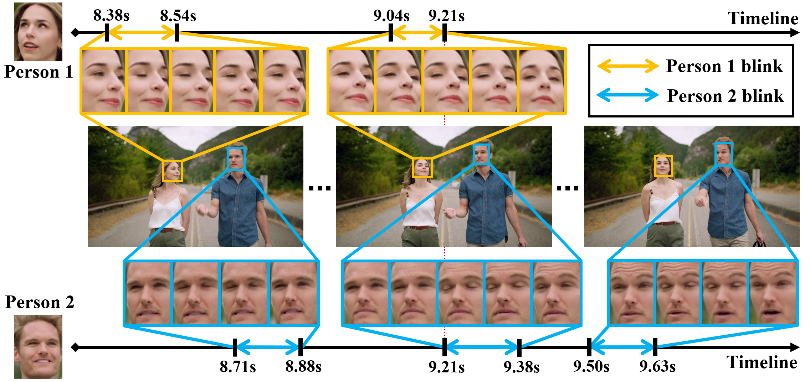

<p align="center">
  <h1 align="center">Real-time Multi-person Eyeblink Detection in the Wild <br>for Untrimmed Video</h1>
  <p align="center">
    <a href="https://wenzhengzeng.github.io/">Wenzheng Zeng</a><sup>1</sup>,
<!--     · -->
    <a href="https://scholar.google.com/citations?user=NeKBuXEAAAAJ">Yang Xiao</a><sup>1</sup>,
<!--     · -->
    Sicheng Wei<sup>1</sup>,
<!--     · -->
    <a>Jinfang Gan</a><sup>1</sup>,
<!--     · -->
    <a>Xintao Zhang</a><sup>1</sup>,
<!--     · -->
    <a href="https://scholar.google.com/citations?user=396o2BAAAAAJ">Zhiguo Cao</a><sup>1</sup>,
<!--     · -->
    <a href="https://scholar.google.com/citations?user=UX5N_FQAAAAJ">Zhiwen Fang</a><sup>2</sup>,
<!--     · -->
    <a href="https://joeyzhouty.github.io/">Joey Tianyi Zhou</a><sup>3</sup>
    
  </p>
  <p align="center"><sup>1</sup>Huazhong University of Science and Technology, <sup>2</sup>Southern Medical University, <sup>3</sup>A*STAR </p>
  <h3 align="center">CVPR 2023</h3>

  <h3 align="center"> <a href="https://wenzhengzeng.github.io/mpeblink/">Project Page</a> | <a href="https://arxiv.org/abs/2303.16053">Paper</a> | <a href="https://www.youtube.com/watch?v=ngME7dym0Uk">Video</a> | <a href="https://wenzhengzeng.github.io/mpeblink/static/images/cvpr23_poster.pdf">Poster</a> | <a href="https://zenodo.org/record/7754768">Dataset</a> | <a href="https://github.com/wenzhengzeng/mpeblink/blob/main/README.md#demo">Demo</a></h3>
    <h3 align="center"> <a href="https://paperswithcode.com/sota/on-mpeblink?p=real-time-multi-person-eyeblink-detection-in">
  
</a> </h3>
  <div align="center"></div>
</p>
<p align="center">
    
<!--    This repository contains the official implementation of the CVPR 2023 paper: "Real-time Multi-person Eyeblink Detection in the Wild for Untrimmed Video". <br> -->

<!--    The official implementation of the CVPR 2023 paper: "Real-time Multi-person Eyeblink Detection in the Wild for Untrimmed Video". -->
</p>
This repository contains the official implementation of the CVPR 2023 paper "Real-time Multi-person Eyeblink Detection in the Wild for Untrimmed Video".


## 🔆 Highlights 

- **New Task:** It is the first time that the task of instance-level multi-person eyeblink detection in untrimmed videos is formally defined and explored. We think that a good multi-person eyeblink detection algorithm should be able to (1) detect and track human instances’ faces reliably to ensure the instance-level analysis ability along the whole video, and (2) detect eyeblink boundaries accurately within each human instance to ensure the precise awareness of their eyeblink behaviors. We design new metrics to give attention to both instance awareness quality and eyeblink detection quality;
- **New Dataset:** To support this research task, we introduce [MPEblink](https://doi.org/10.5281/zenodo.7754768). It is featured with multi-instance, unconstrained, and untrimmed, which makes it more challenging and offers a closer correspondence to real-world demands;
- **New Framework:** We propose a one-stage multi-person eyeblink detection method InstBlink. It can jointly perform face detection, tracking, and instance-level eyeblink detection. Such a task-joint paradigm can benefit the sub-tasks uniformly. Benefited from the one-stage design, InstBlink also shows high efficiency especially in multi-instance scenarios.
- **Open Source:** We release the dataset, model, and code for training, testing, and demo, aiming to foster progress in relevant research fields.

<!-- <div align="center">

</div> -->

## 🚀 Implementation of InstBlink
<!-- <div align="center">

</div> -->
<!-- InstBlink is a one-stage multi-person eyeblink detection framework that can jointly perform face detection, face tracking, and instance-level eyeblink detection. -->

### Installation

1. Create a new conda environment:

   ```bash
   conda create -n instblink python=3.9
   conda activate instblink
   ```
   
2. Install Pytorch (1.7.1 is recommended), scipy, tqdm, pandas.

3. Install MMDetection. 

   * Install [MMCV](https://mmcv.readthedocs.io/en/latest/get_started/installation.html) first. 1.4.8 is recommended.

   * ```bash
     cd MPEblink
     pip install -v -e .
     ```

### Data Preparation

1. Download the [MPEblink dataset](https://doi.org/10.5281/zenodo.7754768). Remember to change the dataset root path into yours in `configs/base/mpeblink.py`.

2. Convert the videos to raw frames.
    ```bash
    python tools/dataset_converters/mpeblink_build_raw_frames_dataset.py --root $YOUR_DATA_PATH
    ```

### ⭐ Demo

You can put some videos in `demo_video/source_video/` and get the visualization inference result in `demo_video/visual_result/` by running the following command:

  ```bash
  bash tools/code_for_demo/demo.sh
  ```


### Inference & Evaluation

* You can download the pre-trained model at [Google Drive](https://drive.google.com/file/d/1kRx_pPpOwAk9D6O3M5Ed7vyAqkZbCh83/view?usp=sharing) or [Baidu Drive (code avk9)](https://pan.baidu.com/s/1UxZ7PDc76wc5y3n5QUqFqg) and put it in the `pretrained_models` directory.

* Run `test.sh` for inference and evaluation. Remember to change the dataset path into yours.

  ```bash
  bash tools/test_eval.sh
  ```


### Training

* Download the pretrained [tevit_r50](https://github.com/hustvl/Storage/releases/download/v1.1.0/tevit_r50.pth) model and place it in the `pretrained_models` directory.

* Run `train.sh` to begin training.

  ```bash
  bash tools/train.sh
  ```

## ❤️ Acknowledgement

This code is inspired by [TeViT](https://github.com/hustvl/TeViT) and [MMDetection](https://github.com/open-mmlab/mmdetection). Thanks for their great contributions on the computer vision community.

## 🎓 Citation

If you find our work useful in your research, please consider to cite our paper:

  ```
  @inproceedings{zeng2023real,
    title={Real-time Multi-person Eyeblink Detection in the Wild for Untrimmed Video},
    author={Zeng, Wenzheng and Xiao, Yang and Wei, Sicheng and Gan, Jinfang and Zhang, Xintao and Cao, Zhiguo and Fang, Zhiwen and Zhou, Joey Tianyi},
    booktitle={Proceedings of the IEEE/CVF Conference on Computer Vision and Pattern Recognition (CVPR)},
    pages={13854--13863},
    year={2023}
  }
  ```

